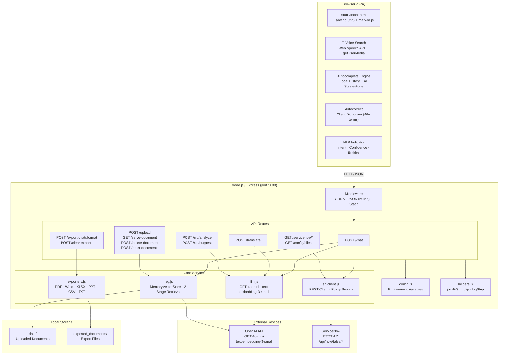
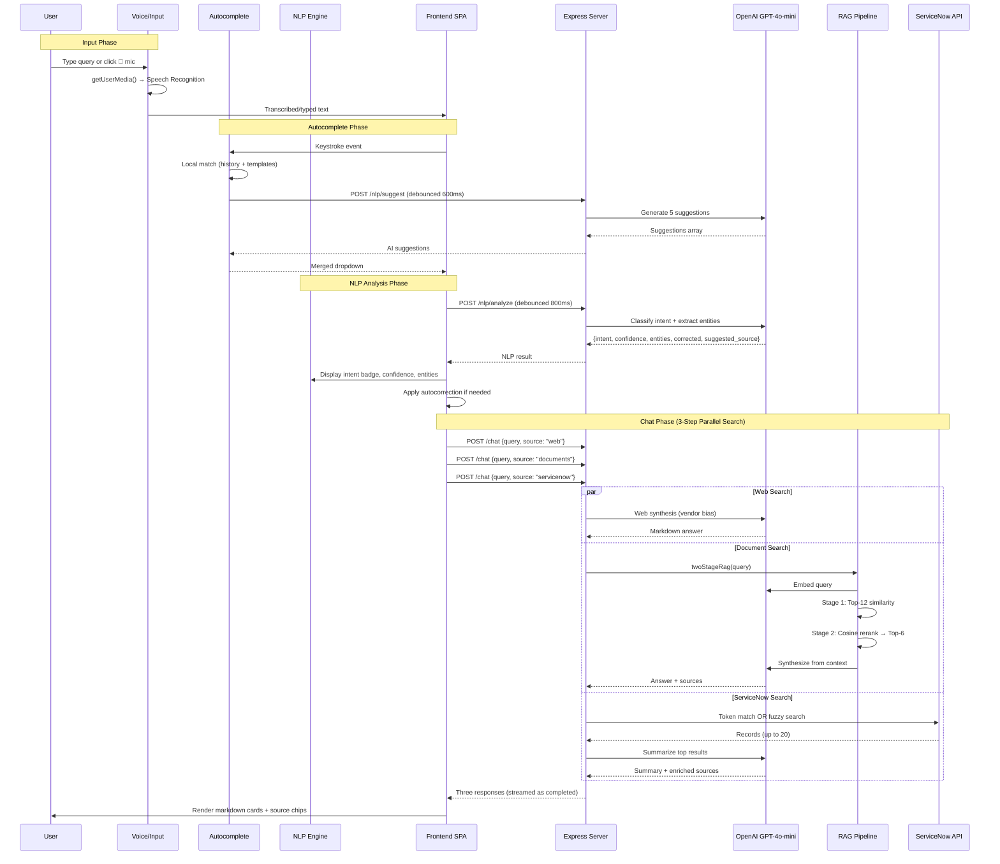
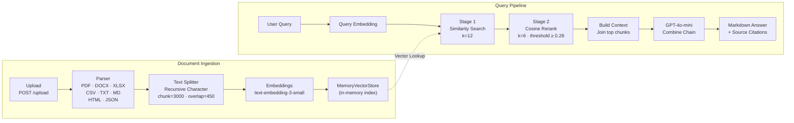
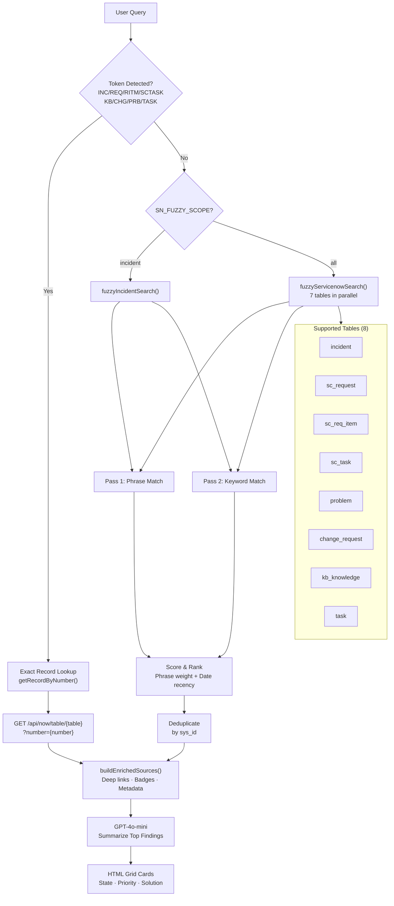
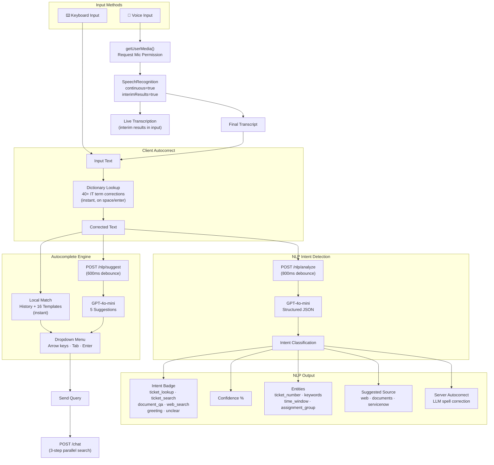
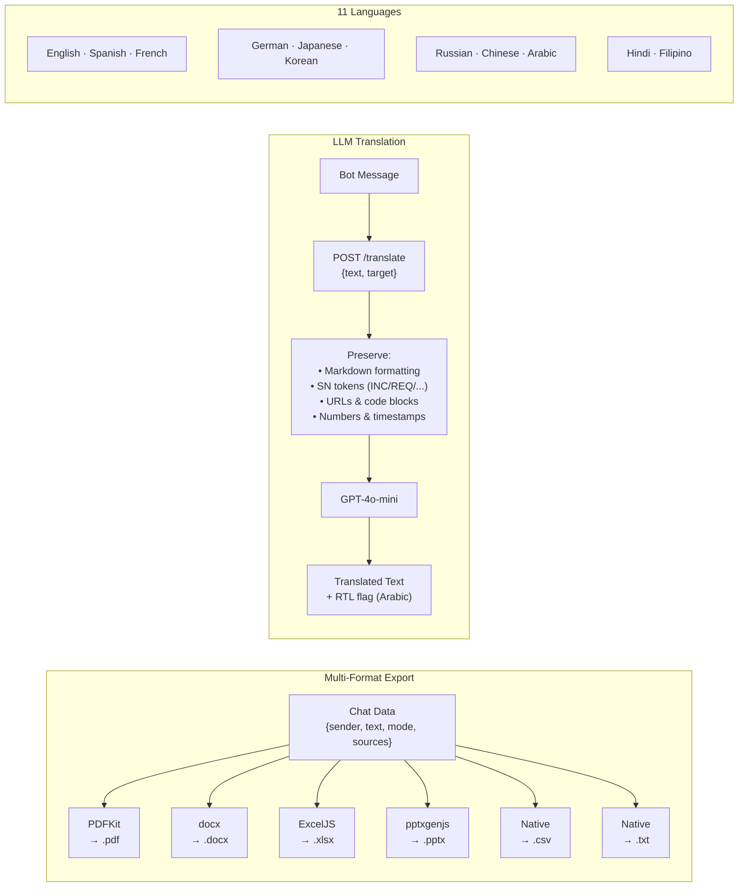
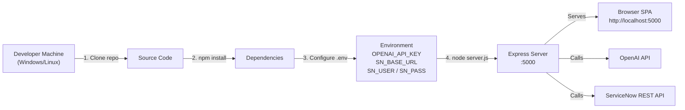

# Solution Manager — Architecture Document

## System Overview

Solution Manager is a full-stack AI-powered chatbot for IT support built on **Node.js/Express** with **OpenAI GPT-4o-mini** and **LangChain**. It provides a single-page application frontend that communicates with backend services for document Q&A (RAG), ServiceNow integration, web knowledge synthesis, NLP intent detection, voice search, autocomplete, translation, and multi-format export.

---

## High-Level Architecture



---

## Request Flow Diagram



---

## RAG Pipeline Architecture



**Key Parameters:**
| Parameter | Value | Purpose |
|-----------|-------|---------|
| `RAG_CHUNK_SIZE` | 3000 | Characters per chunk |
| `RAG_CHUNK_OVERLAP` | 450 | Overlap between chunks |
| `RAG_TOP_K` | 12 | Stage 1 retrieval count |
| `RAG_RERANK_K` | 6 | Stage 2 final results |
| `RAG_MIN_SIM` | 0.28 | Minimum cosine similarity |

---

## ServiceNow Integration Architecture



---

## NLP & Voice Search Architecture



---

## Export & Translation Architecture



---

## Project Structure

```
Solution_Manager/
├── server.js                    # Express entry point (port 5000)
├── package.json                 # Dependencies & scripts
├── .env                         # Environment variables (not committed)
├── setup-node.ps1               # Windows setup script
├── run-node.bat                 # Windows run script
│
├── src/
│   ├── config.js                # All configuration & env vars
│   ├── routes/
│   │   ├── chat.js              # POST /chat (web/documents/servicenow)
│   │   ├── documents.js         # Upload, serve, delete, reset documents
│   │   ├── exports.js           # POST /export-chat/:format (6 formats)
│   │   ├── servicenow.js        # SN incident, search, groups, health
│   │   ├── translate.js         # POST /translate (11 languages)
│   │   └── nlp.js               # POST /nlp/analyze, POST /nlp/suggest
│   ├── services/
│   │   ├── llm.js               # OpenAI GPT-4o-mini + embeddings init
│   │   ├── rag.js               # RAG pipeline (load, split, embed, query)
│   │   ├── sn-client.js         # ServiceNow REST client + fuzzy search
│   │   └── exporters.js         # PDF, Word, XLSX, PPT, CSV, TXT generators
│   └── utils/
│       └── helpers.js           # joinToStr, clip, logStep, formatSourceList
│
├── static/
│   └── index.html               # Complete SPA frontend (~1500+ lines)
│                                  • Voice search (Web Speech API)
│                                  • Autocomplete (local + AI)
│                                  • Autocorrect (client dictionary)
│                                  • NLP intent indicator
│                                  • 3-step chat flow
│                                  • Translation (11 languages)
│                                  • Export controls
│                                  • Dark/light mode
│                                  • Document management
│                                  • Conversation history sidebar
│
├── data/                        # Uploaded documents (RAG source)
└── exported_documents/          # Generated export files
```

---

## Technology Stack

| Layer | Technology | Purpose |
|-------|-----------|---------|
| **Runtime** | Node.js 18+ | Server runtime |
| **Framework** | Express.js 4.21 | HTTP server, routing, middleware |
| **LLM** | OpenAI GPT-4o-mini | Chat completions, NLP analysis, translation, web synthesis |
| **Embeddings** | text-embedding-3-small | Document & query vector embeddings |
| **Orchestration** | LangChain 0.3 | Chains, prompts, text splitters, vector store |
| **Vector Store** | MemoryVectorStore | In-memory similarity search |
| **ServiceNow** | Axios + REST API | ITSM data retrieval (8 table types) |
| **Voice** | Web Speech API + getUserMedia | Browser-native speech-to-text |
| **NLP** | GPT-4o-mini (structured JSON) | Intent detection, entity extraction, autocorrect |
| **PDF Parse** | pdf-parse 1.1 | PDF text extraction |
| **Word Parse** | mammoth 1.8 | DOCX text extraction |
| **Excel** | ExcelJS 4.4 | XLSX read/write |
| **PDF Export** | PDFKit 0.15 | PDF generation |
| **Word Export** | docx 9.0 | DOCX generation |
| **PPT Export** | pptxgenjs 4.0 | PPTX generation |
| **File Upload** | Multer 1.4 | Multipart form data handling |
| **Frontend** | Tailwind CSS (CDN) | Responsive UI styling |
| **Markdown** | marked.js (CDN) | Markdown → HTML rendering |
| **State** | localStorage | Conversation history, theme, font size |

---

## API Endpoints Summary

### Chat & Search
| Method | Endpoint | Purpose |
|--------|----------|---------|
| POST | `/chat` | Main chat (web/documents/servicenow modes) |

### NLP & Intelligence
| Method | Endpoint | Purpose |
|--------|----------|---------|
| POST | `/nlp/analyze` | Intent detection + entity extraction + autocorrect |
| POST | `/nlp/suggest` | AI-powered autocomplete suggestions |

### Document Management
| Method | Endpoint | Purpose |
|--------|----------|---------|
| POST | `/upload` | Upload document for RAG indexing |
| GET | `/serve-document` | Retrieve uploaded document |
| POST | `/delete-document` | Delete single document |
| POST | `/reset-documents` | Delete all documents |

### Export
| Method | Endpoint | Purpose |
|--------|----------|---------|
| POST | `/export-chat/:format` | Export chat (pdf/word/xlsx/ppt/csv/txt) |
| POST | `/clear-exports` | Clear exported files |

### ServiceNow
| Method | Endpoint | Purpose |
|--------|----------|---------|
| GET | `/servicenow/incident` | Fetch single incident by number/sys_id |
| GET | `/servicenow/search` | Fuzzy multi-table search |
| GET | `/servicenow/groups` | List assignment groups |
| GET | `/servicenow/health` | Table accessibility check |
| GET | `/config/client` | Public client config |
| GET | `/debug-sn` | Debug ServiceNow connection (dev only) |

### Translation
| Method | Endpoint | Purpose |
|--------|----------|---------|
| POST | `/translate` | Translate text to target language |

---

## Security Considerations

| Area | Implementation |
|------|---------------|
| **Credentials** | Environment variables via `.env` (never committed) |
| **Path Traversal** | Blocked in document upload/serve (rejects `..` in paths) |
| **File Whitelist** | Only approved extensions accepted for upload |
| **CORS** | Configurable allowed origins |
| **ServiceNow Auth** | Basic auth over HTTPS |
| **Body Limit** | 50MB JSON limit prevents oversized payloads |
| **Input Sanitization** | Export filenames sanitized before write |

---

## Deployment



**Quick Start:**
```bash
# 1. Install dependencies
npm install

# 2. Create .env with API keys
cp .env.example .env

# 3. Start server
npm start        # production
npm run dev      # development (hot-reload)
```
